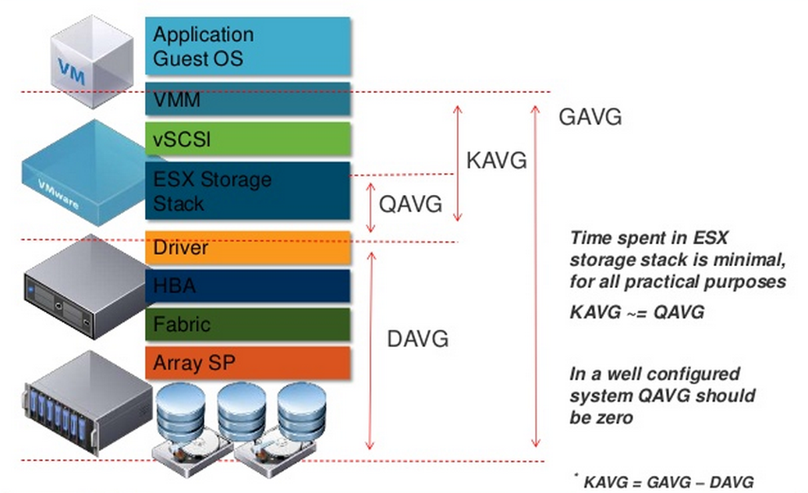

# Investigating ESXi Latency

### On ESXi shell,
[esxtop](https://www.virten.net/vmware/esxtop/)

1. Monitoring storage performance per HBA: d, f, b, c, d, e, h, j, s, 2, Enter.
2. Monitoring storage performance per LUN: u, f, b, c, f, h, s, 2, Enter.
3. Monitoring storage performance per VM: v, f, b, d, e, h, j, s, 2, Enter.

### Latency in a nutshell,

